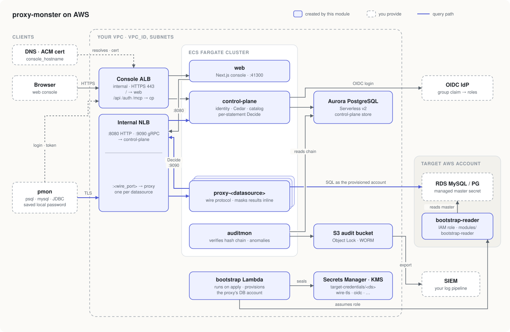

# Architecture

What one `module "proxy_monster"` creates, what it expects the caller to bring,
and what stays a manual step.

## Topology

A query goes pmon → NLB → `proxy-<datasource>`, which asks the control plane (back through the NLB on :9090) to
Decide each statement, then runs it on the target DB as the account the
bootstrap Lambda provisioned, masking results inline.

Both load balancers are internal. The console and the wire endpoints are reached
from inside the VPC or over peering / transit / VPN; `console_extra_ingress_cidrs`
admits callers outside the VPC CIDR.

## Components

| File | Creates |
|---|---|
| `ecs.tf` | ECS cluster; services `control-plane`, `web`, `auditmon`, `proxy-<ds>` per entry of `datasources`, and `<name>-tailscale` when `tailscale` is set |
| `alb.tf` | Console ALB, HTTPS listener on an existing ACM cert, HTTP→HTTPS redirect |
| `nlb.tf` | Internal NLB: control-plane HTTP/gRPC and one listener per datasource wire port |
| `aurora.tf` | Aurora Serverless v2 PostgreSQL for the control-plane store |
| `s3.tf` | Audit export bucket with Object Lock (`audit_lock_mode`, `audit_retention_days`) |
| `kms.tf` | Keys: audit signer, target credentials, one `rds-admin/<alias>` per target account |
| `secrets.tf` | Secrets Manager entries (generated or empty shells, see below) |
| `bootstrap.tf` + `bootstrap/` | Python Lambda that provisions the proxy's DB account on each target; seal-audit log, metric, and alarm |
| `modules/bootstrap-reader` | IAM role applied in each target account; lets the Lambda read RDS-managed master secrets |

## Inputs the caller brings

- Network: `vpc_id`, `vpc_cidr`, `private_subnets`, `database_subnets`. The
  module creates no VPC. Subnets are looked up with `for_each`, so a VPC created
  in the same root must exist before the first plan of this module (one
  `-target` apply).
- Console: `console_hostname` and an **ISSUED** ACM certificate in the region
  (looked up by primary domain; `console_cert_domain` overrides). The DNS record
  pointing `console_hostname` at the `console_alb_dns_name` output is the caller's.
- Images: `images` — one URI per component. Public images are on
  `public.ecr.aws/w1t1s2q1/pm-*`.
- Identity: `oidc` (issuer, client id, `group_map`). `null` runs the console
  auth-disabled; use only for a first boot.
- Targets: `datasources` and, for credentials the module provisions,
  `target_credential_groups`. An `athena` datasource has no target DB or
  credentials secret: its proxy's task role queries Athena in this account,
  scoped to one workgroup, catalog, and set of S3 prefixes.
  `athena.denied_glue_resources` carves sensitive databases and tables out of
  that scope with an explicit Deny, and `athena.lake_formation` adds the
  `lakeformation:GetDataAccess` that Lake Formation-registered locations need.
- Naming: `instance.name` is the MCP install name (`pmon-<name>`); unset, it is
  the first label of `console_hostname`.
- Apply role: `target_credentials_key_admin_role_arns` and
  `rds_admin_key_enabler_role_arns` must name the role that runs `terraform apply`,
  or the KMS key policies refuse it.
- Tailnet console (optional): `tailscale` runs one keyless Tailscale node that
  advertises a Tailscale Service and forwards 80/443 to the console ALB. Before
  the first apply:
  - Enable IAM outbound web identity federation in the account.
  - In the tailnet, define the Service, let the tag own and auto-approve it, and
    create a federated identity whose issuer is the account's
    `https://<id>.tokens.sts.global.api.aws` URL, whose subject is the
    `tailscale_task_role_arn` output, and whose scopes allow `auth_keys` with
    that tag. Its id is `tailscale.client_id`.

  The console records the node's private address as `requester_ip` for clients
  that arrive this way.

## Secrets

| Secret | Filled by |
|---|---|
| `db-master`, `session-secret`, `result-key`, `grpc-token` | Generated by the module |
| `oidc-client-secret` | Operator, from the IdP app |
| `wire-tls` | Operator, using the `wire_tls_issuance` output after the first apply |
| `target-credentials/<ds>` (MySQL, PostgreSQL) | Bootstrap Lambda when the datasource has a `credential_group`; operator otherwise |
| `master-credentials/<id>` | Operator, for external (non-RDS) credential groups |
| `slack`, `alert-slack-webhook` | Operator, optional |

## Target credential bootstrap

For an RDS-backed `target_credential_groups` entry:

1. The target cluster sets `manage_master_user_password = true` and
   `master_user_secret_kms_key_id = rds_admin_key_arns[<alias>]`. RDS cannot
   re-key an already managed secret: turn managed credentials off, then on with
   the key.
2. `modules/bootstrap-reader` is applied in the target account.
3. On apply, the Lambda assumes the reader role, reads the master secret,
   creates or updates the proxy's account with the group's `schemas` and
   `privileges`, and writes the credential into each datasource's secret,
   encrypted with the target-credentials key. The master password never enters
   Terraform state.

When the cluster and the credential group live in the same root,
`rds_identifier` must be a literal: the KMS key this module creates encrypts
the cluster's master secret, so a reference closes a cycle.

## Naming

`name` (default `proxy-monster`) prefixes every resource. The bootstrap role
names are literal (`<name>-bootstrap`, `<name>-bootstrap-reader`) because KMS
and trust policies match them as strings. Two stacks in one account need
different `name`s.

## Not in this module

VPC, DNS zone and record, ACM certificate, IdP application, target databases,
`pmon` client distribution. `examples/` shows each wired in.
